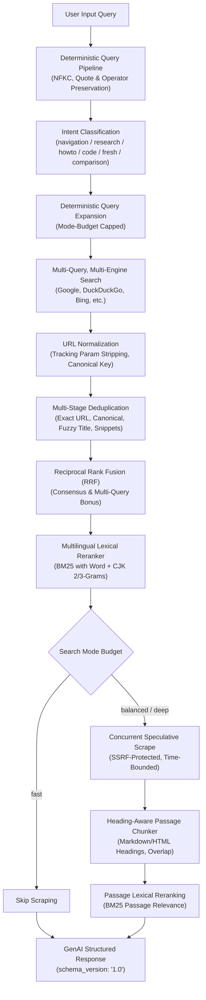

# SearXNG GenAI Retrieval API Reference & Architecture

SearXNG for Windows Next provides a high-quality, citation-dense **Retrieval API** purpose-built for GenAI models, autonomous AI coding agents (Claude Desktop, Cursor, Roo Code, Windsurf), and Model Context Protocol (MCP) clients.

> [!IMPORTANT]
> **Core Architectural Principle:**
> This service is **not** an answer generation or summarization engine. It does not generate synthetic answers, conversational summaries, or financial analysis.
> Instead, it operates strictly as a **grounded retrieval foundation**, supplying downstream AI models with deterministic query normalization, deduplicated search results, explainable ranking scores, and heading-aware evidence passages.

---

## 1. Logical Retrieval Pipeline

The retrieval pipeline processes every query through an auditable, deterministic sequence:



---

## 2. Search Modes & Computational Budgets

Every request operates under an explicit computational and concurrency budget. No background loops or unbounded agent crawls are permitted.

| Budget Dimension | `fast` Mode | `balanced` Mode (Default) | `deep` Mode |
|---|:---:|:---:|:---:|
| **Primary Goal** | Sub-second latency, zero scraping | Balanced speed & evidence passages | Deep candidate pool & multi-angle evidence |
| **Max Expanded Queries** | 1 (original only) | 2 (1 expansion) | 3 (2 expansions) |
| **Max Results per Query** | 10 | 15 | 20 |
| **Max Candidate Pool** | 10 | 20 | 30 |
| **Scraped Pages Budget** | **0** | **3** | **6** |
| **Passages per Page** | 0 | 3 | 4 |
| **Total Passages Budget** | 0 | 6 | 12 |
| **Max Character Budget** | 4,000 chars | 12,000 chars | 25,000 chars |
| **Request Deadline** | 5,000 ms | 10,000 ms | 18,000 ms |
| **Scrape Timeout** | N/A | 5,000 ms | 7,000 ms |
| **Max Search Rounds** | 1 | 1 | 2 |

---

## 3. Structured Response Schema (`schema_version: "1.0"`)

The GenAI retrieval response format is available via `format=json_ai`, `format=evidence_json`, or the dedicated `/api/retrieval` endpoint.

```json
{
  "schema_version": "1.0",
  "query": {
    "original": "Python 3.12 新機能 asyncio",
    "normalized": "Python 3.12 新機能 asyncio",
    "intent": "research",
    "language": "ja",
    "freshness": "2024"
  },
  "search": {
    "mode": "balanced",
    "expanded_queries": [
      "Python 3.12 新機能 asyncio architecture"
    ],
    "engines_used": [
      "duckduckgo",
      "google"
    ],
    "partial": false,
    "elapsed_ms": 2.7
  },
  "results": [
    {
      "id": "src_01",
      "title": "Python 3.12 の新機能 — Python 3.12 ドキュメント",
      "url": "https://docs.python.org/ja/3/whatsnew/3.12.html",
      "canonical_url": "https://docs.python.org/ja/3/whatsnew/3.12.html",
      "domain": "docs.python.org",
      "published_at": "2023-10-02T00:00:00Z",
      "updated_at": "2024-04-10T12:00:00Z",
      "date_source": "meta_article_published",
      "date_confidence": "high",
      "source_type": "documentation",
      "score": 0.8842,
      "score_components": {
        "fusion": 0.6500,
        "lexical_relevance": 0.9200,
        "freshness": 0.8000,
        "source_quality": 0.9500,
        "engine_consensus": 0.1500
      },
      "matched_queries": [
        "Python 3.12 新機能 asyncio"
      ],
      "engines": [
        "duckduckgo",
        "google"
      ],
      "snippet": "Python 3.12 では asyncio のパフォーマンス改善が導入されました。",
      "evidence": [
        {
          "id": "src_01_p01",
          "heading": "asyncioの改良",
          "text": "asyncio モジュールのパフォーマンスが大幅に改善され、イベントループのオーバーヘッドが低減されました。",
          "score": 6.5
        }
      ],
      "security_flags": []
    }
  ],
  "warnings": []
}
```

---

## 4. Score Definitions & Explainability

All ranking decisions provide explainable breakdowns in `score_components`.

| Score Factor | Scale | Definition & Intended Use |
|---|:---:|---|
| `fusion` | 0.0 – 1.0+ | Reciprocal Rank Fusion score: `sum(1 / (k + rank))`. Higher when present at top ranks across multiple engines or queries. |
| `engine_consensus` | 0.0 – 0.45 | Bounded bonus (+0.15 per confirming engine) awarded when distinct search engines corroborate the result. |
| `lexical_relevance` | 0.0 – 1.0 | BM25 term frequency matching across title (3.0x), headings (2.0x), and content (1.0x). Uses word tokens for Latin scripts and character 2/3-grams for CJK. |
| `source_quality` | 0.1 – 1.0 | **Structural citation suitability** (e.g., official docs, RFCs, primary git repositories).<br>**WARNING**: This represents citation suitability, **NOT a guarantee of factual truth**. |
| `freshness` | 0.0 – 1.0 | Temporal alignment score when the search query expresses recency demand and verified publication metadata is available. |

---

## 5. Security & Trust Architecture

Web content retrieved from third-party sites is treated as **untrusted, hostile data**.

### 5.1 Server-Side Request Forgery (SSRF) Defense
- **Strict Protocol Filtering**: Only `http://` and `https://` schemes are permitted. Schemes such as `file://`, `ftp://`, `gopher://` are rejected.
- **Private IP Blocking**: Blocks IPv4 loopback (`127.0.0.0/8`), RFC1918 private ranges (`10.0.0.0/8`, `172.16.0.0/12`, `192.168.0.0/16`), link-local (`169.254.0.0/16`), and multicast.
- **IPv6 Defense**: Blocks `::1`, unique-local (`fc00::/7`), and link-local (`fe80::/10`).
- **Obfuscation Defense**: Blocks integer, octal, and hexadecimal encoded IP variants (`http://2130706433`, `http://0x7f000001`).
- **DNS Rebinding & Re-resolution**: Redirect targets are re-validated before following.

### 5.2 Prompt Injection Detection
Retrieved text and HTML are inspected by `SecurityScanner`.
- If patterns attempting to hijack model instructions are detected (`ignore previous instructions`, `reveal system prompt`, `前の指示を無視せよ`, etc.), the passage is flagged with `"security_flags": ["possible_prompt_injection"]`.
- The document is **not** deleted, ensuring security research and technical advisory documentation can still be cited safely while warning downstream agents.

---

## 6. Interface Usage Guide

### 6.1 HTTP API

#### Endpoint: `/api/retrieval` (or `/search?format=json_ai`)

```bash
# Balanced Retrieval (Default)
curl -X GET "http://127.0.0.1:8888/api/retrieval?q=FastAPI+lifespan+tutorial&mode=balanced"

# Fast Mode (Sub-second, search snippets only)
curl -X GET "http://127.0.0.1:8888/api/retrieval?q=python+asyncio&mode=fast"

# Deep Mode (Expanded multi-query search, up to 6 scraped pages)
curl -X GET "http://127.0.0.1:8888/api/retrieval?q=CVE-2024-21626+advisory&mode=deep"
```

#### Existing `json_lite` Endpoint (100% Backward Compatible)
```bash
curl -X GET "http://127.0.0.1:8888/search?q=SearXNG&format=json_lite"
```

---

### 6.2 Model Context Protocol (MCP)

The MCP server exposes two search tools:

#### 1. `searxng_retrieval` (Recommended for AI Coding Agents)
Provides structured, citation-dense evidence passages:

```json
{
  "name": "searxng_retrieval",
  "arguments": {
    "query": "React 19 actions form handling",
    "mode": "balanced",
    "categories": "it"
  }
}
```

#### 2. `searxng_search` (Updated with balanced mode support)
```json
{
  "name": "searxng_search",
  "arguments": {
    "query": "Python 3.12 asyncio",
    "mode": "balanced"
  }
}
```

---

### 6.3 Command Line Interface (CLI)

#### Subcommand: `retrieval`
```powershell
# Balanced retrieval with passage evidence
.\python\python.exe tools\searxng_cli.py retrieval "FastAPI lifespan events"

# Fast retrieval (JSON output)
.\python\python.exe tools\searxng_cli.py retrieval "python asyncio" --mode fast --json

# Deep retrieval
.\python\python.exe tools\searxng_cli.py retrieval "CVE-2024-38856" --mode deep
```

#### Subcommand: `search` (with `--ai` flag)
```powershell
.\python\python.exe tools\searxng_cli.py search "SearXNG architecture" --mode balanced --ai
```

---

## 7. Optional Cross-Encoder Neural Reranking

For environments requiring neural semantic reranking, `sentence-transformers` can be installed:

```powershell
.\python\python.exe -m pip install sentence-transformers
```

Configuration in code:
```python
from cross_encoder_rerank import CrossEncoderConfig, CrossEncoderReranker

reranker = CrossEncoderReranker(CrossEncoderConfig(enabled=True, model_name="cross-encoder/ms-marco-MiniLM-L-6-v2"))
```

- If `sentence-transformers` is absent or the model download fails, the system automatically falls back to multilingual BM25 lexical reranking with zero disruption or error.
